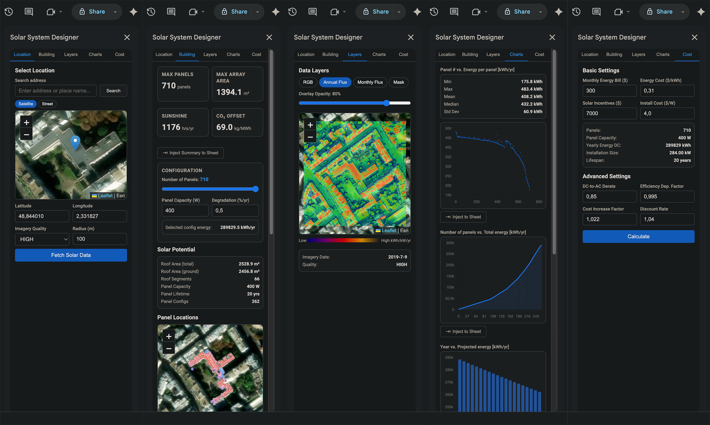

# solar-gs

A collection of Google Sheets add-ons for fetching, visualizing, and analyzing solar energy data from different APIs. Each add-on provides a sidebar interface for configuring queries, previewing results, and injecting data directly into spreadsheet tabs.

| Add-on                                | API Source                                                                 | API Key         | Coverage                       |
| ------------------------------------- | -------------------------------------------------------------------------- | --------------- | ------------------------------ |
| [google-solar-gs](./google-solar-gs/) | [Google Solar API](https://developers.google.com/maps/documentation/solar) | Required (paid) | Global (where imagery exists)  |
| [nrel-solar-gs](./nrel-solar-gs/)     | [NREL Solar API](https://developer.nrel.gov/)                              | Required (free) | United States                  |
| [pvgis-gs](./pvgis-gs/)               | [PVGIS API](https://ec.europa.eu/jrc/en/pvgis)                             | Not required    | Europe, Africa, Asia, Americas |

---

## google-solar-gs — Solar System Designer

Fetches rooftop-level solar potential from the **Google Solar API**. Includes building insights (roof area, panel count, segment geometry), GeoTIFF data layer overlays (annual flux, monthly flux, mask, RGB), interactive Chart.js energy visualizations, and a financial cost/payback calculator. Location is selected via address search or an interactive Leaflet satellite map.

**Key features:** building insights with panel placement map · data layer visualization with adjustable opacity · per-panel energy charts and statistics · lifetime cost analysis with configurable financial parameters · sheet injection for all data types · API response caching

[Full README →](./google-solar-gs/README.md)

---

## nrel-solar-gs — NREL Solar

Queries three NREL API endpoints: **PVWatts V8** for grid-connected PV energy production estimates, **Solar Resource** for average DNI/GHI/tilt-at-latitude data, and **Solar Dataset Query V2** for discovering nearby weather station datasets. Location is selected via an interactive Leaflet map. Results are written to named sheets with key metrics displayed in the sidebar.

**Key features:** PVWatts V8 with configurable system parameters (capacity, module type, array type, tilt, azimuth, losses) · solar resource monthly averages · dataset discovery with station metadata · sidebar result summary with annual output and capacity factor

[Full README →](./nrel-solar-gs/README.md)

---

## pvgis-gs — PVGIS Data

Fetches solar irradiation and PV performance data from the European Commission's PVGIS service. Covers 8 calculation tools across dedicated tabs: grid-connected PV, tracking PV, off-grid PV with battery, monthly/daily/hourly radiation time-series, typical meteorological year (TMY), and horizon profile. No API key is required. Location is selected via an OpenStreetMap-powered Leaflet map with optional custom horizon profiles.

**Key features:** 8 data tabs covering all PVGIS calculators · configurable radiation database, PV technology, mounting, and loss parameters · optional LCOE calculation · radiation component breakdown (beam, diffuse, reflected) · automatic sheet creation per fetch · no API key needed

[Full README →](./pvgis-gs/README.md)

---

## Tech Stack

All three add-ons share the same architecture:

- **Runtime:** Google Apps Script (V8)
- **UI:** HTML/CSS/JS sidebar served via `HtmlService`
- **Maps:** [Leaflet.js](https://leafletjs.com/) for interactive location selection
- **Data output:** Named Google Sheets tabs created/updated programmatically

## Installation

Each add-on is installed independently by copying its source files into a Google Apps Script project bound to a spreadsheet (or by deploying with [clasp](https://github.com/google/clasp)). See each add-on's README for detailed setup instructions.

## License

**MIT License**.

All add-on source code is provided for educational and personal use only. Commercial use, redistribution, or derivative works are prohibited without explicit permission from the author.
