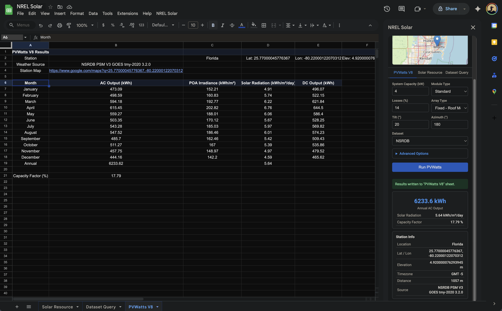
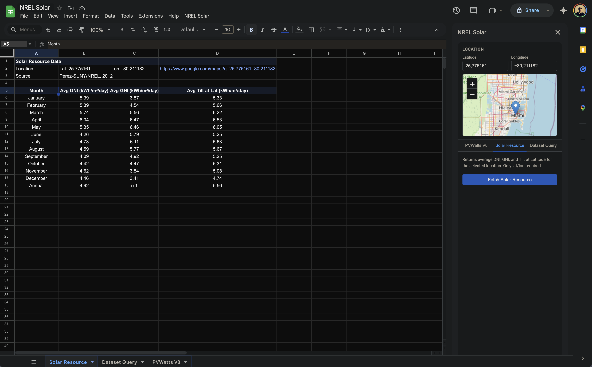
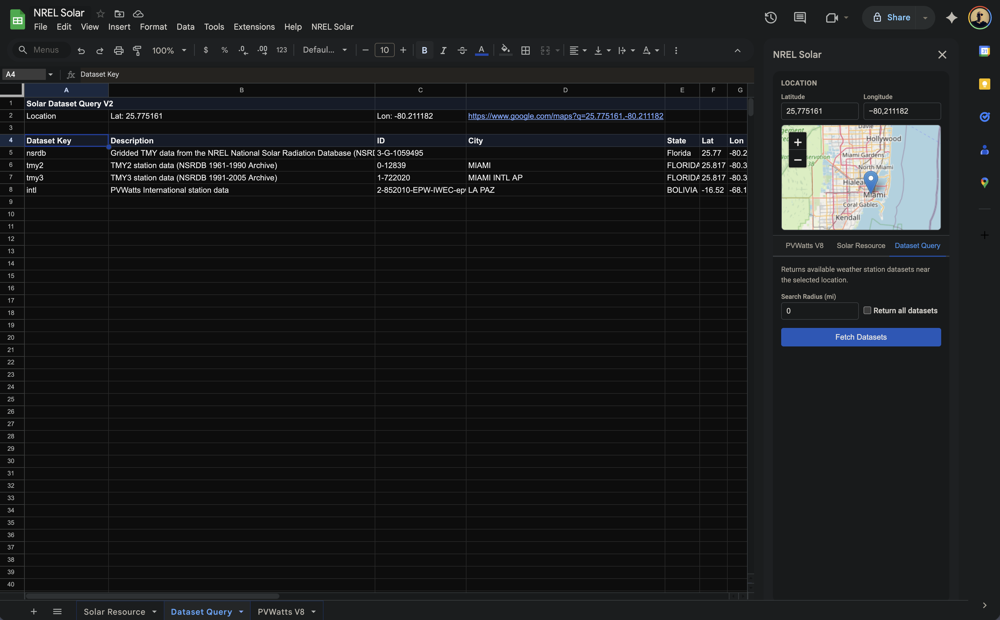

# NREL Solar GS

A Google Sheets add-on that queries the NREL Solar API for solar resource data and PVWatts energy production estimates.

## Features

- **PVWatts V8** -- Estimate energy production of grid-connected PV systems with configurable system parameters (capacity, module type, array type, tilt, azimuth, etc.)
- **Solar Resource Data** -- Retrieve average DNI, GHI, and Tilt at Latitude for any US location
- **Solar Dataset Query V2** -- Find available weather station datasets near a location
- Interactive **Leaflet.js** map for location picking
- Results are written to named sheets and key metrics are displayed in the sidebar

## Setup

### Prerequisites

- [Node.js](https://nodejs.org/) (for clasp)
- [clasp](https://github.com/google/clasp) -- Google Apps Script CLI

```bash
npm install @google/clasp -g
clasp login
```

### Deploy

Deploy using [Clasp](https://developers.google.com/apps-script/guides/clasp) or copy the files manually to _Script Editor_.

##### Clasp

1. Create a new Google Apps Script project bound to a Google Sheet, or create a standalone project:

```bash
clasp create --type sheets --title "NREL Solar" --rootDir src
```

This will update `.clasp.json` with the new script ID.

2. Push the code:

```bash
clasp push
```

3. Open the spreadsheet and set your NREL API key via the **NREL Solar > Set API Key...** menu item. Get a free key at [developer.nrel.gov](https://developer.nrel.gov/signup/).

4. Open the sidebar via **NREL Solar > Open Panel**.

## Project Structure

```
src/
  appsscript.json   -- Apps Script manifest (scopes, runtime)
  Code.gs           -- Menu, sidebar, include() helper, API key management
  ApiService.gs     -- NREL API request functions (PVWatts, Solar Resource, Dataset Query)
  SheetService.gs   -- Write API responses to named spreadsheet tabs
  Sidebar.html      -- Main sidebar HTML (loads Styles + Script via templating)
  Styles.html       -- CSS for the sidebar UI
  Script.html       -- Client-side JavaScript (map, forms, API calls)
```

## API Endpoints

| Endpoint         | URL Path                            | Parameters                                                                                     |
| ---------------- | ----------------------------------- | ---------------------------------------------------------------------------------------------- |
| PVWatts V8       | `/api/pvwatts/v8.json`              | lat, lon, system_capacity, module_type, losses, array_type, tilt, azimuth, dataset, + advanced |
| Solar Resource   | `/api/solar/solar_resource/v1.json` | lat, lon                                                                                       |
| Dataset Query V2 | `/api/solar/data_query/v2.json`     | lat, lon, radius, all                                                                          |

## Rate Limits

The NREL API allows a maximum of 1,000 requests per hour per API key.

## UI

#### PVWatts V8



See also the [NREL online LCOE calculator](https://www.nlr.gov/pv/lcoe-calculator).

#### Solar Resource



#### Dataset Query



## License

MIT License.
