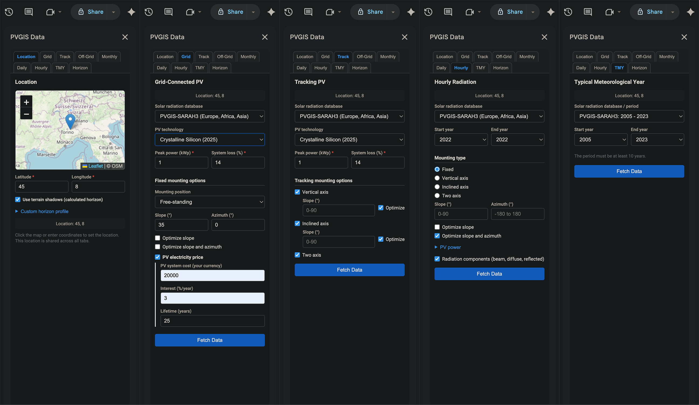
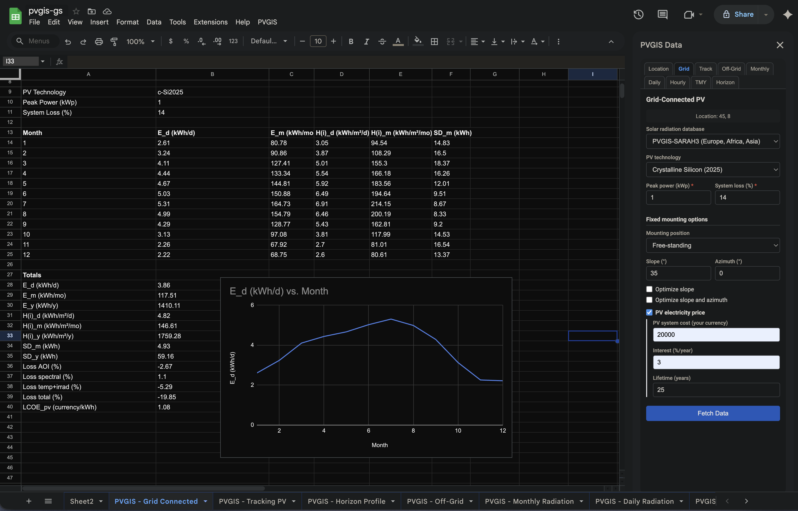

# PVGIS-GS

A Google Sheets add-on for fetching solar energy data from [PVGIS](https://ec.europa.eu/jrc/en/pvgis) (Photovoltaic Geographical Information System) directly into your spreadsheets. No API key required.

PVGIS is developed by the European Commission's Joint Research Centre (JRC) and provides free access to solar radiation data, PV performance estimates, and related climate parameters for locations across Europe, Africa, Asia, and the Americas.

## Features

- **Interactive location selector** — Pick coordinates on an OpenStreetMap-powered map, enter them manually, or drag the marker. Location persists across sessions.
- **Custom horizon profile** — Supply your own horizon heights or fetch the DEM-calculated profile.
- **8 data tabs** covering all PVGIS calculator tools:

| Tab                   | Description                                                                       | API Endpoint   |
| --------------------- | --------------------------------------------------------------------------------- | -------------- |
| **Grid-Connected**    | Performance of grid-connected PV. Monthly + yearly totals, losses, optional LCOE. | `PVcalc`       |
| **Tracking PV**       | Performance with vertical-axis, inclined-axis, and/or two-axis tracking.          | `PVcalc`       |
| **Off-Grid**          | Standalone PV + battery system performance, including charge-state histogram.     | `SHScalc`      |
| **Monthly Radiation** | Monthly global, diffuse, and direct-normal irradiation over multiple years.       | `MRcalc`       |
| **Daily Radiation**   | Average daily irradiance profiles (all components) for selected month(s).         | `DRcalc`       |
| **Hourly Radiation**  | Hourly time-series of irradiance, PV power, temperature, and wind speed.          | `seriescalc`   |
| **TMY**               | Typical Meteorological Year — representative hourly climate data.                 | `tmy`          |
| **Horizon Profile**   | Horizon heights + winter/summer solstice sun paths.                               | `printhorizon` |

- **Google Maps link** — Every output sheet includes a clickable GMAPS URL for the queried location.
- **Automatic sheet creation** — Each fetch creates (or replaces) a dedicated named sheet.

## UI

#### Add-On Tabs



#### Grid-Connected PV



## Installation

The add-on is installed by copying the source files into a Google Apps Script project bound to your spreadsheet.

### Step-by-step

Deploy using [Clasp](https://developers.google.com/apps-script/guides/clasp) or copy files manually to _Script Editor_.

#### Copy files manually

1. Open a Google Sheets spreadsheet (or create a new one).
2. Go to **Extensions → Apps Script**. This opens the script editor.
3. Delete any existing code in the editor (e.g., the default `myFunction`).
4. Create the following **script files** (`.gs`) by clicking **+ → Script**. Name each file exactly as shown (the `.gs` extension is added automatically):
   - `Code`
   - `Config`
   - `PvgisApi`
   - `SheetWriter`
5. Create the following **HTML files** by clicking **+ → HTML**. Name each file exactly as shown (the `.html` extension is added automatically):
   - `Sidebar`
   - `Styles`
   - `Scripts`
   - `LocationTab`
   - `GridConnected`
   - `TrackingPV`
   - `OffGrid`
   - `MonthlyRadiation`
   - `DailyRadiation`
   - `HourlyRadiation`
   - `TMY`
   - `HorizonProfile`
6. Copy-paste the contents of each file from the `src/gs/` and `src/html/` folders in this repository into the corresponding file in the script editor.
7. Open the `appsscript.json` manifest:
   - In the script editor, click **⚙ Project Settings** (gear icon on the left sidebar).
   - Check **Show "appsscript.json" manifest file in editor**.
   - Go back to the editor and open `appsscript.json`.
   - Replace its contents with the contents of `src/appsscript.json` from this repository.
8. Click **Save** (or `Ctrl+S` / `Cmd+S`).
9. Go back to your spreadsheet and **reload the page**.
10. A new **PVGIS** menu item will appear in the menu bar. Click **PVGIS → Open Sidebar** to start.

> **Note:** The first time you use the sidebar features, Google will ask you to authorize the add-on. It requires two permissions: access to the current spreadsheet and the ability to make external HTTP requests (to the PVGIS API).

## Usage

1. **Set location** — Open the sidebar and use the **Location** tab to pick your coordinates on the map or enter lat/lon manually.
2. **Choose a data tab** — Select one of the 8 data tabs (Grid-Connected, Tracking PV, etc.).
3. **Configure parameters** — Set the desired options (radiation database, PV technology, angles, year range, etc.).
4. **Fetch data** — Click the **Fetch Data** button. The add-on calls the PVGIS API and writes the results into a new sheet.
5. **Analyze** — The data is now in your spreadsheet; use standard Google Sheets features (charts, formulas, pivot tables) for further analysis.

## Key Parameters

The table below lists the most commonly used parameters. Each tab exposes the relevant subset of these in its form.

| Parameter        | Type  | Description                                                                     | Default        |
| ---------------- | ----- | ------------------------------------------------------------------------------- | -------------- |
| `lat`            | Float | Latitude (decimal degrees, south is negative)                                   | —              |
| `lon`            | Float | Longitude (decimal degrees, west is negative)                                   | —              |
| `raddatabase`    | Text  | Radiation database (`PVGIS-SARAH3`, `PVGIS-NSRDB`, `PVGIS-ERA5`, `PVGIS-COSMO`) | `PVGIS-SARAH3` |
| `peakpower`      | Float | Nominal PV system power (kWp)                                                   | `1`            |
| `pvtechchoice`   | Text  | PV technology (`crystSi`, `crystSi2025`, `CIS`, `CdTe`, `Unknown`)              | `crystSi`      |
| `loss`           | Float | System losses (%)                                                               | `14`           |
| `mountingplace`  | Text  | Mounting type (`free`, `building`)                                              | `free`         |
| `angle`          | Float | Fixed-system tilt from horizontal (°)                                           | `0`            |
| `aspect`         | Float | Fixed-system azimuth (°, 0 = south, 90 = west, −90 = east)                      | `0`            |
| `startyear`      | Int   | Start year for time-series data                                                 | DB-dependent   |
| `endyear`        | Int   | End year for time-series data                                                   | DB-dependent   |
| `batterysize`    | Float | Battery capacity in Wh (off-grid)                                               | `600`          |
| `consumptionday` | Float | Daily consumption in Wh (off-grid)                                              | `300`          |

For the full list of parameters for each endpoint, see the [PVGIS API documentation](https://joint-research-centre.ec.europa.eu/photovoltaic-geographical-information-system-pvgis/getting-started-pvgis/api-non-interactive-service_en#ref-3-horizon-profile).

## Project Structure

```
pvgis-gs/
├── src/
│   ├── gs/                  # Server-side Google Apps Script
│   │   ├── Code.gs          # Entry point, menu, sidebar, location persistence
│   │   ├── Config.gs        # Constants, dropdown options, defaults
│   │   ├── PvgisApi.gs      # API calls and endpoint wrappers
│   │   └── SheetWriter.gs   # Sheet creation and data output
│   ├── html/                # Client-side HTML/CSS/JS
│   │   ├── Sidebar.html     # Main sidebar shell with tab navigation
│   │   ├── Styles.html      # All CSS
│   │   ├── Scripts.html     # Shared JS (tabs, map, form serialization, API calls)
│   │   ├── LocationTab.html # Location picker with Leaflet map
│   │   ├── GridConnected.html
│   │   ├── TrackingPV.html
│   │   ├── OffGrid.html
│   │   ├── MonthlyRadiation.html
│   │   ├── DailyRadiation.html
│   │   ├── HourlyRadiation.html
│   │   ├── TMY.html
│   │   └── HorizonProfile.html
│   └── appsscript.json      # Manifest (runtime, scopes, add-on metadata)
├── notes/                   # Development notes, test responses, input parameter CSVs
├── imgs/                    # UI screenshots
└── README.md
```

## Technical Details

- **Runtime:** Google Apps Script V8
- **PVGIS API version:** 5.3 (base URL: `https://re.jrc.ec.europa.eu/api/v5_3`)
- **Map library:** [Leaflet.js](https://leafletjs.com/) v1.9.4 with OpenStreetMap tiles
- **Rate limit:** PVGIS allows 30 API calls per second (no API key needed)
- **Sidebar width:** 320 px

## Resources

- [PVGIS home page](https://ec.europa.eu/jrc/en/pvgis)
- [PVGIS User Manual](https://joint-research-centre.ec.europa.eu/photovoltaic-geographical-information-system-pvgis/getting-started-pvgis/pvgis-user-manual_en)
- [PVGIS API documentation](https://joint-research-centre.ec.europa.eu/photovoltaic-geographical-information-system-pvgis/getting-started-pvgis/api-non-interactive-service_en#ref-3-horizon-profile)
- [PVGIS Calculator (web UI)](https://re.jrc.ec.europa.eu/pvg_tools/en/tools.html#api_5.3)

## License

MIT License. See [LICENSE.txt](LICENSE.txt).
